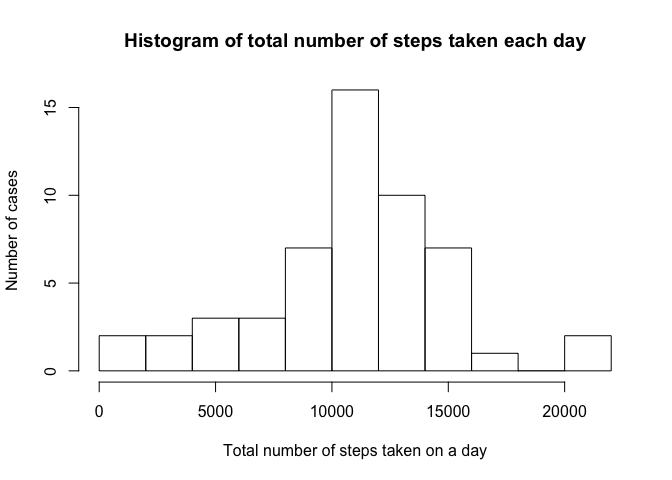
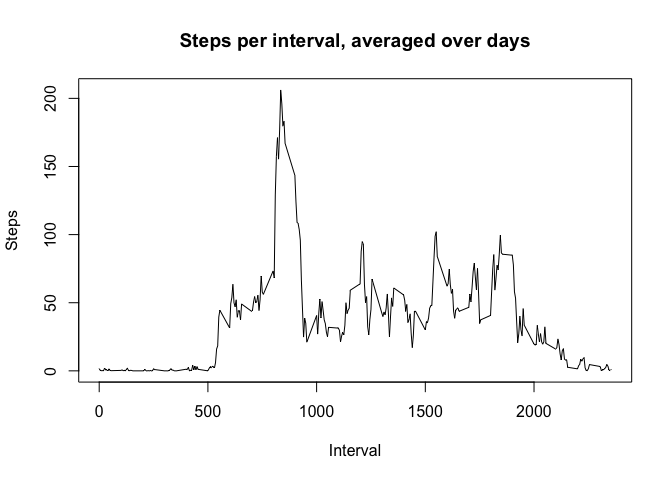
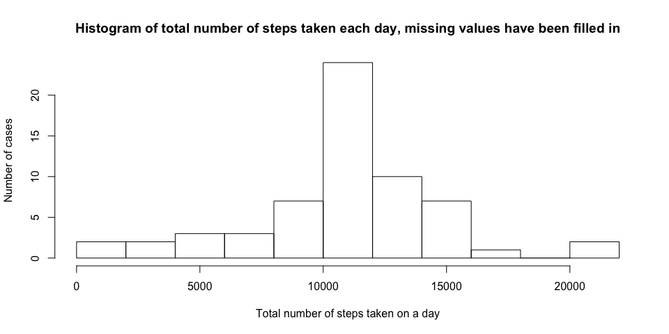

# Reproducible Research: Peer Assessment 1
  
## Loading data
  
The activity.csv file, which results from unzipping activity.zip, should be located in the working directory.
  

```r
  data <- read.csv("./activity.csv")
```

## What is the mean total number of steps taken per day?

Missing value will be ignored when calculating the total number of steps taken per day.


```r
library(dplyr)
stepsPerDay <- data[!is.na(data$steps),c("steps","date")] %>% group_by(date) %>% summarise_each(funs(sum))
stepsPerDay
```

```
## Source: local data frame [53 x 2]
## 
##          date steps
##        (fctr) (int)
## 1  2012-10-02   126
## 2  2012-10-03 11352
## 3  2012-10-04 12116
## 4  2012-10-05 13294
## 5  2012-10-06 15420
## 6  2012-10-07 11015
## 7  2012-10-09 12811
## 8  2012-10-10  9900
## 9  2012-10-11 10304
## 10 2012-10-12 17382
## ..        ...   ...
```

The histogram of total number of steps taken per day :


```r
hist(stepsPerDay$steps, 
     breaks = 10,
     main = "Histogram of total number of steps taken each day",
     xlab = "Total number of steps taken on a day",
     ylab = "Number of cases")
```

 

The mean and median of total number of steps taken per day is calculated as follows:


```r
meanStepsPerDay <- mean(stepsPerDay$steps)
medianStepsPerDay <- median(stepsPerDay$steps)
```

The mean is 1.0766189\times 10^{4}  
The median is 10765

##Average daily activity pattern

The average daily activity pattern can be visualized on a graph.   In order to identify the pattern, the approach taken here is to average the number of steps per interval over days.


```r
stepsPerInterval <- data[!is.na(data$steps),c("steps","interval")] %>% group_by(interval) %>% summarise_each(funs(mean))
plot(stepsPerInterval$interval,stepsPerInterval$steps,
     type = 'l',
     main = "Steps per interval, averaged over days",
     xlab = "Interval",
     ylab = "Steps")
```

 

Let's look for the maximum number of steps per interval.


```r
maxValue <- max(stepsPerInterval$steps)
maxInterval <- stepsPerInterval[stepsPerInterval$steps == maxValue,]$interval
maxSteps <- stepsPerInterval[stepsPerInterval$steps == maxValue,]$steps
```

The interval which has the maximum average number of steps over days is 835, with average number of steps 206.1698113.

## Imputing missing values

Calculating the number of NAs in the original dataset:


```r
sum(is.na(data$steps))
```

```
## [1] 2304
```

In order to fill all the missing values of the dataset, the proposed approach is, for a given interval, to fill it with the mean for that interval over days.  
The avg function returns the average number of steps over days for a given time interval.


```r
avg <- function(interval){
  mean(data[data$interval == interval,]$steps, na.rm = TRUE)
}

newdata <- data
newdata[is.na(newdata$steps),]$steps <- avg(newdata[is.na(newdata$steps),]$interval)
```

```
## Warning in data$interval == interval: la taille d'un objet plus long n'est
## pas multiple de la taille d'un objet plus court
```

```r
summary(newdata)
```

```
##      steps                date          interval     
##  Min.   :  0.00   2012-10-01:  288   Min.   :   0.0  
##  1st Qu.:  0.00   2012-10-02:  288   1st Qu.: 588.8  
##  Median :  0.00   2012-10-03:  288   Median :1177.5  
##  Mean   : 37.38   2012-10-04:  288   Mean   :1177.5  
##  3rd Qu.: 37.38   2012-10-05:  288   3rd Qu.:1766.2  
##  Max.   :806.00   2012-10-06:  288   Max.   :2355.0  
##                   (Other)   :15840
```

This time, missing values have been filled in. Calculation of the number of steps per day :


```r
stepsPerDay2 <- newdata[,c("steps","date")] %>% group_by(date) %>% summarise_each(funs(sum))
stepsPerDay2
```

```
## Source: local data frame [61 x 2]
## 
##          date    steps
##        (fctr)    (dbl)
## 1  2012-10-01 10766.19
## 2  2012-10-02   126.00
## 3  2012-10-03 11352.00
## 4  2012-10-04 12116.00
## 5  2012-10-05 13294.00
## 6  2012-10-06 15420.00
## 7  2012-10-07 11015.00
## 8  2012-10-08 10766.19
## 9  2012-10-09 12811.00
## 10 2012-10-10  9900.00
## ..        ...      ...
```

The histogram of total number of steps taken per day is now:


```r
hist(stepsPerDay2$steps, 
     breaks = 10,
     main = "Histogram of total number of steps taken each day, missing values have been filled in",
     xlab = "Total number of steps taken on a day",
     ylab = "Number of cases")
```

 


```r
meanStepsPerDay2 <- mean(stepsPerDay2$steps)
medianStepsPerDay2 <- median(stepsPerDay2$steps)
```

The mean is now 1.0766189\times 10^{4}  
The median is now 1.0766189\times 10^{4}

Imputing missing values did not have a major impact on previous estimates.


```r
newdata$date <- as.Date(newdata$date,format = "%Y-%M-%d")
weekdays = c("Lundi","Mardi","Mercredi","Jeudi","Vendredi")
weekend = c("Samedi","Dimanche")
dayLabel <- function(day){
  if(as.character(day) %in% weekdays){"Weekday"}
  if(as.character(day) %in% weekend){"Weekend"}
}
#transform(newdata,dayType = dayLabel(weekdays(date)))
```

